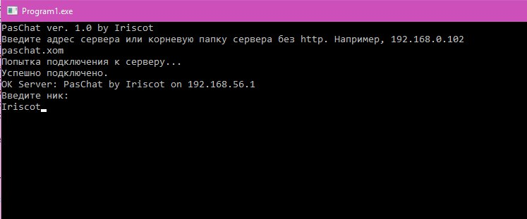

# Paschat
```
    ____             ________          __ 
   / __ \____ ______/ ____/ /_  ____ _/ /_
  / /_/ / __ `/ ___/ /   / __ \/ __ `/ __/
 / ____/ /_/ (__  ) /___/ / / / /_/ / /_  
/_/    \__,_/____/\____/_/ /_/\__,_/\__/  
                                          
			© Iriscot 2017
```




PasChat — чатик, написанный на Pascal и использующий PHP в качестве сервера. Я написал его, когда учился в шараге исключительно ради лулзов и чтобы развлечь себя на лабораторных. Выкладываю исходный код как отсылку к тем временам.

**Установка:**
1. В файле db.php прописать данные для подключения к БД.
2. Запустите скрипт `install.php` — будет создана таблица.
3. Зайдите на хост в `index.php`, там будут ссылка на клиент.

**Подключение:**
1. Запустите клиент.
2. Введите IP или хост своего сервера.
3. ?????
4. PROFIT!!!
